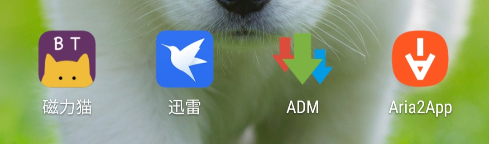
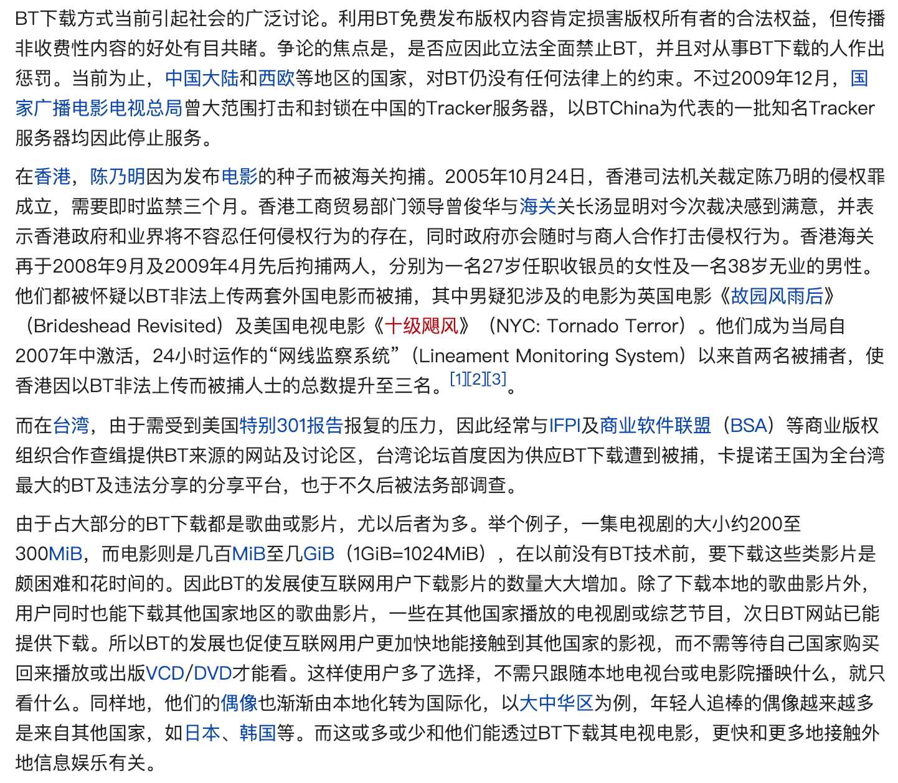
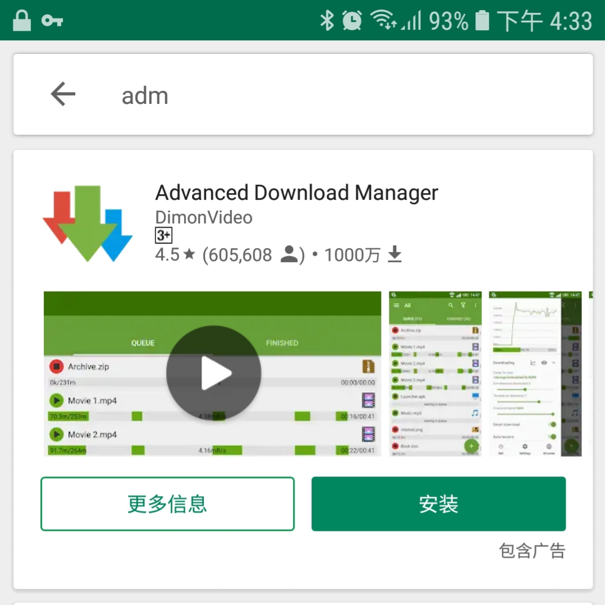
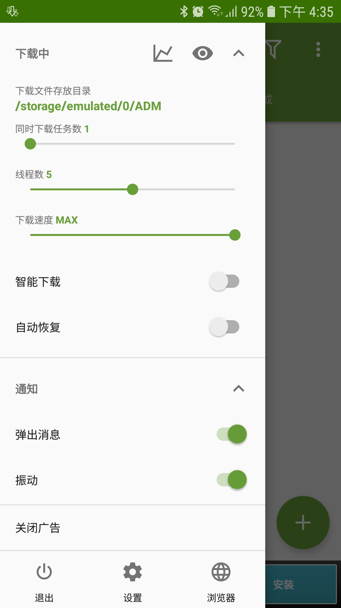
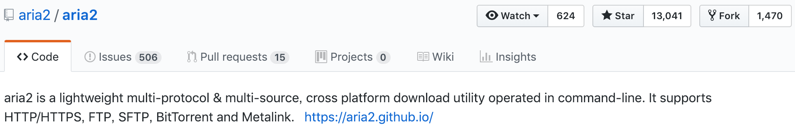
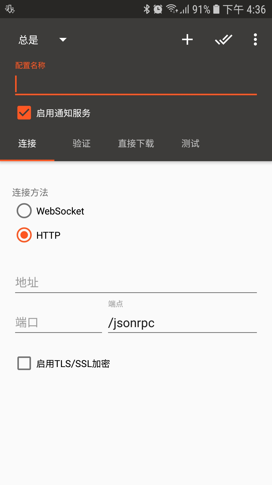

# 安卓下载工具从入门到放弃

首先放出一张图来看看我们今天要了解的几款应用：

然后我们依照顺序介绍。

### 迅雷

迅雷，对，就是它。不管你有多厌倦它或者嫌弃它，但你无法否定它不是一款优秀的下载工具，虽然有些时候它可能表现一般，甚至无法工作，但是在90%的情况下迅雷是99%的人最好的选择。

迅雷大家都太熟悉，所以我也不可能再去讲解迅雷如何使用。这里说说下载的几个要素，这些因素会影响你的下载速度，下载是否成功等。

##### 下载主要因素

下载主要因素如下：
 1. 下载链接是否有效：无效的地址肯定是会失败的。
 2. 是否联网：没联网肯定下载失败，网络环境差（比如网络卡顿，丢包严重等）也会导致下载失败，但是迅雷支持断点续传，一般的即使提示失败我们再手动重试几次也能下载成功的。
 3. 硬盘空间是否足够：这个简单，如果下载2GB的电影，但是手机空间只有1GB，那么肯定下载失败。

##### 种子下载
当下载的资源是种子的时候，情况就变的特殊起来了，因为BT种子不是普通的点对点的下载。

> 引用百度百科的一段介绍
> 
> 比特流（BitTorrent）是一种内容分发协议，由布拉姆·科恩自主开发。它采用高效的软件分发系统和点对点技术共享大体积文件（如一部电影或电视节目），并使每个用户像网络重新分配结点那样提供上传服务。一般的下载服务器为每一个发出下载请求的用户提供下载服务，而BitTorrent的工作方式与之不同。**分配器或文件的持有者将文件发送给其中一名用户，再由这名用户转发给其它用户，用户之间相互转发自己所拥有的文件部分，直到每个用户的下载都全部完成。这种方法可以使下载服务器同时处理多个大体积文件的下载请求，而无须占用大量带宽。**

**总结起来就是：下载的人越多，速度越快。**

**那么问题来了，如果有一个资源种子很冷门（也就是没人下载），那么你的速度就会很慢。这里再联想一种极端情况，一个资源种子足够冷门，那么就是死种，这样的种子你就是加上1000兆的带宽也没用，你无法下载它，它的速度永远都是0kb/s。**遇到这样的中就只有更换一个相对热门的种子了，目前没有啥好办法了。

##### 合法性
种子下载的第二个大问题：合法性。这里直接拿`wiki`的来说明吧。

> 截图来自wiki:https://zh.wikipedia.org/wiki/BitTorrent_(%E5%8D%8F%E8%AE%AE)

表现在迅雷中就是，敏感资源无法下载。至于什么才是敏感资源，我也不清楚，目前来看应该是侵权资源、琴瑟资源等肯定会是敏感资源。

如果是一个普通的合法资源，用迅雷速度很慢，但是自己的网络带宽又很快，这时有可能是迅雷为了逼迫你开通会员，这时你就可以使用 ADM下载器来提高下载速度了。

### ADM下载器（Advanced Download Manager）

谷歌市场下载量超1000万！

它的主要特点：
 - 网络上最多可同时三个文件下载；
 - 通过使用多线程加速下载（9 个线程）；
 - 在后台下载的文件失败后恢复；
 - 从浏览器和剪贴板中截取链接；
 - 可定制性极高

##### 定制性高

为什么说它的定制性高，除了它默认的特性多线程，让多个线程同时下载来提高整体的下载速度外，它甚至能帮你打破百度云的限制。具体的操作可以在搜索引擎中搜索“ADM 使用”或者“ADM 搜索使用”，教程特别多，请对照使用。

### Aria2
Aria2是一个开源的命令行下载器，它支持 HTTP/HTTPS, FTP, SFTP, BitTorrent（种子链接） and Metalink 等协议下的下载，并且他是开源的，开源主页：https://github.com/aria2/aria2 。

目前有13k的赞，已经相当的厉害了。它具有以下特性：

- 多线程连线：aria2 会自动从多个线程下载文件，并充分利用你的带宽；
- 轻量：运行时不会占用过多资源，根据官方介绍，内存占用通常在 4MB~9MB，使用 BitTorrent 协议，下行速度 2.8MB/s 时 CPU 占用率约 6%；
- 全功能 BitTorrent 客户端；
- 支持 RPC 界面远程控制

由于Aria2是命令行下载工具，也就是它默认不带操作界面，你只能在windows或者Mac的终端里操作。如果你现在仍然没接触过`cmd`或`terminal`，那么我建议你使用上面推荐的ADM下载器。毕竟Aria2学习曲线陡峭，需要的动手能力也比较强。

这里推荐一个图形界面 `Aria2App`，这个app只是提供了一个可视化的图形界面，核心的东西还是Aria2.
它大概长这样：

不过还是得手动输入配置，最后点测试，链接没问题就可以使用。

**有兴趣的话可以自己搜索这方面的教程，这里只做简单的介绍。目的只是让大家知道除了迅雷，还有很多强大的下载器，只不过迅雷操作简单捕获了大部分人，其他的或多或少有点门槛，希望大家按照自身的情况选择自己心仪的下载方式。**

好了，本文到这里就结束了。关注公众号，回复下载器或者ADM下载链接。

